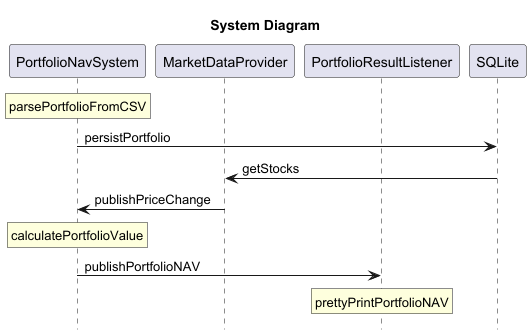

# Portfolio NAV System

## Description

This project consists of 3 separate services to show the real time value of a given portfolio provided in the
position.csv file.

### The PortfolioNAVSystem

1. Read and Parse the position CSV file
2. Persist the parsed Portfolio into DB (SQLite)
3. Consume PriceChange from the MarketDataProvider
4. Calculate PortfolioNavResult based on the new price
5. Publish PortfolioNavResult to PortfolioResultListener

### MarketDataProvider

1. Read the available stocks from DB (SQLite)
2. Simulate stock movement by generating PriceChange according to a discrete geometric Brownian motion at a random
   interval (0.5-2seconds)
3. Publish the PriceChange to the PortfolioNAVSystem

### PortfolioResultListener

1. Consume the PortfolioNavResult from PortfolioNAVSystem
2. Pretty print the PortfolioNavResult

## How to build

1. Generate Java Classes from Protobuf  
   `protoc --java_out=src/main/java src/main/proto/PortfolioNavResult.proto`
2. Gradle build  
   `./gradlew build`

## How to run

Start the services in this order

1. PortfolioResultListener
2. PortfolioNAVSystem
3. MarketDataProvider

## Assumption:

1. Symbol length is variable between 4-6 bytes
2. A random stock is picked at a random interval between 0.5-2 seconds
3. The maturity date of any option is also after the current date
4. There is less than 10 holdings in the portfolio

## ByteBuffer Allocation

**PriceChange**

* Symbol Length: 4 bytes (int)
* Symbol: 6 bytes (String)
* Price: 8 bytes (double)
* Total: 18 bytes

**PortfolioNavResult Length**

* Length: 4 bytes (int)

**PortfolioNavResult**

_Holding_

* Symbol: 23 bytes (String)
* Price: 8 bytes (double)
* Quantity: 8 bytes (double)
* Value: 8 bytes (double)
* Total: 47 bytes

_PortfolioNavResult_

* PriceChangeTicker: 4-6 bytes (String)
* PriceChangeValue: 8 bytes (double)
* List of Holdings: 30 bytes each
* Value: 8 bytes (double)
* PriceChangeCount: 4 bytes (int)
* Total: 26 bytes + number of holding * 47

## Diagram

  
Diagram Source Code: diagram/systemDiagram.puml

## Further Development

* Refactor PortfolioNavResult publisher to publish PortfolioNavResult without using Protobuf. This is to avoid creating
  new PortfolioNavBuilder in each iteration to further reduce memory usage.
